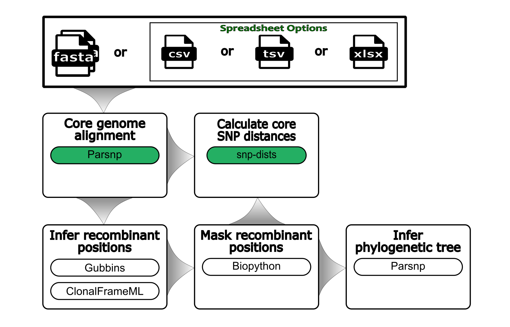

<h1>
  <picture>
    <source media="(prefers-color-scheme: dark)" srcset="docs/images/wf-assembly-snps_logo_dark.png">
    
  </picture>
</h1>


[](https://www.nextflow.io/)
[](https://www.docker.com/)
[](https://sylabs.io/docs/)
[](https://github.com/bacterial-genomics/wf-assembly-snps/actions/workflows/mega-linter.yml)



> _General schematic of the steps in the workflow_

## Contents

- [Quick Start](#quick-start-test)
- [Introduction](#introduction)
- [Installation](#installation)
- [Usage](#usage)
- [Parameters](#parameters)
  - [Required parameters](#required-parameters)
  - [Additonal parameters](#additional-parameters)
- [Resource Managers](#resource-managers)
- [Output](#output)
- [Troubleshooting](#troubleshooting)
- [Contributions and Support](#contributions-and-support)
- [Citations](#citations)

## Quick Start: Test

Run the built-in test set to confirm all parts are working as-expected. It will also download all dependencies to make subsequent runs much faster.

### Pull workflow from GitHub

```bash
nextflow pull bacterial-genomics/wf-assembly-snps -r main
```

### Run test workflow

```bash
nextflow run \
  bacterial-genomics/wf-assembly-snps \
  -r main \
  -profile docker,test \
  --outdir results
```

## Quick Start: Run

Example command on FastAs in "new-fasta-dir" data using **ParSNP** with Docker:

### Standard datasets (<200 genomes)

```bash
nextflow run main.nf \
  -profile docker \
  --input new-fasta-dir \
  --outdir my-results \
  --snp_package parsnp
```

### Large datasets (200+ genomes)

For large datasets, use the optimized `large_dataset` profile:

```bash
nextflow run main.nf \
  -profile large_dataset \
  --input new-fasta-dir \
  --outdir my-results \
  --snp_package parsnp \
  --max_memory 600.GB
```

### DGX A100 systems (512GB RAM, 64 CPUs)

For NVIDIA DGX A100 systems:

```bash
nextflow run main.nf \
  -profile dgx_a100 \
  --input new-fasta-dir \
  --outdir my-results \
  --snp_package parsnp
```

### Google Cloud VM Large instances (1,536GB RAM, 192 vCPUs)

For Google Cloud ultra-high-memory instances:

```bash
nextflow run main.nf \
  -profile google_vm_large \
  --input new-fasta-dir \
  --outdir my-results \
  --snp_package parsnp
```

### Smart Resume from ParSNP Outputs

The pipeline now supports **smart resume** capabilities that can skip time-consuming steps when resuming from existing ParSNP outputs:

**Auto-detect existing alignment (recommended):**
```bash
nextflow run main.nf \
  -profile google_vm_large \
  --parsnp_outputs /path/to/parsnp_outputs \
  --outdir /path/to/results \
  --recombination gubbins
```

**Force skip GINGR conversion:**
```bash
nextflow run main.nf \
  -profile google_vm_large \
  --parsnp_outputs /path/to/parsnp_outputs \
  --outdir /path/to/results \
  --recombination gubbins \
  --skip_gingr_conversion
```

**Use specific alignment file:**
```bash
nextflow run main.nf \
  -profile google_vm_large \
  --parsnp_outputs /path/to/parsnp_outputs \
  --outdir /path/to/results \
  --recombination gubbins \
  --alignment_file /path/to/existing/Parsnp.Core_Alignment.fasta
```

**Check resume options:**
```bash
./bin/check_resume_options.sh /path/to/parsnp_outputs /path/to/results
```

**Note**: Large datasets require significant computational resources. See [Memory Optimization Guide](docs/memory-optimization.md) for detailed requirements and troubleshooting.

## Introduction

This workflow performs average nucleotide identity on assembled and/or annotated files (FastA/Genbank).

## Installation

- [Nextflow](https://www.nextflow.io/docs/latest/getstarted.html#installation) `>=22.04.03`
- [Docker](https://docs.docker.com/engine/installation/) or [Singularity](https://www.sylabs.io/guides/3.0/user-guide/) `>=3.8.0`
- [Conda](https://docs.conda.io/projects/conda/en/latest/user-guide/install/index.html) is currently unsupported

## Usage

```bash
nextflow run main.nf \
  -profile docker \
  --input <input directory> \
  --ref <optional reference file> \
  --outdir <directory for results> \
  --snp_package <parsnp>
```

Please see the [usage documentation](docs/usage.md) for further information on using this workflow.

## Parameters

Note the "`--`" long name arguments (e.g., `--help`, `--input`, `--outdir`) are generally specific to this workflow's options, whereas "`-`" long name options (e.g., `-help`, `-latest`, `-profile`) are general nextflow options.

These are the most pertinent options for this workflow:

### Required parameters

```console
  ============================================
        Input/Output
  ============================================
  --input                 Path to input data directory containing FastA/Genbank assemblies or samplesheet.
                          Recognized extensions are:  {fasta,fas,fna,fsa,fa} with optional gzip compression.

  --ref                   Path to reference file in FastA format.
                          Recognized extensions are:  {fasta,fas,fna,fsa,fa} with optional gzip compression. [Default: NaN]

  --outdir                The output directory where the results will be saved.


  ============================================
        Container platforms
  ============================================
  -profile singularity    Use Singularity images to run the workflow.
                          Will pull and convert Docker images from Dockerhub if not locally available.

  -profile docker         Use Docker images to run the workflow.
                          Will pull images from Dockerhub if not locally available.


  ============================================
        Optional alignment tools
  ============================================
  --snp_package           Specify what algorithm should be used to compare input files.
                          Recognized arguments are: parsnp. [Default: parsnp]
```

### Additional parameters

View help menu of all workflow options:

```bash
nextflow run \
  bacterial-genomics/wf-assembly-snps \
  -r main \
  --help \
  --show_hidden_params
```

## Resource Managers

The most well-tested and supported is a Univa Grid Engine (UGE) job scheduler with Singularity for dependency handling.

1. UGE/SGE
    - Additional tips for UGE processing are [here](docs/HPC-UGE-scheduler.md).
2. No Scheduler
    - It has also been confirmed to work on desktop and laptop environments without a job scheduler using Docker with more tips [here](docs/local-device.md).

## Output

Please see the [output documentation](docs/output.md) for a table of all outputs created by this workflow.

## Troubleshooting

### Common Issues

**Q: It failed, how do I find out what went wrong?**
A: View file contents in the `<outdir>/pipeline_info` directory.

**Q: Bus error (exit status 135) in Gubbins process?**
A: The pipeline now includes **automatic fallback** for bus errors. When Gubbins fails due to memory issues, it automatically switches to a lightweight method that allows the pipeline to continue.

**Automatic Fallback**: The pipeline will detect bus errors and automatically fall back to lightweight recombination detection, which skips intensive recombination analysis but produces phylogenetic trees and distance matrices.

**Manual Solutions** by system type:

For DGX Station A100 (512GB RAM):
```bash
nextflow run main.nf -profile dgx_a100
```

For Google Cloud large instances (1,536GB RAM):
```bash
nextflow run main.nf -profile google_vm_large
```

For ultra-large datasets (300+ genomes) or to force lightweight method:
```bash
nextflow run main.nf -profile google_vm_large --recombination_method lightweight
```

For other high-memory systems:
```bash
nextflow run main.nf -profile large_dataset --max_memory 600.GB
```

**Check your dataset size**:
```bash
./bin/check_dataset_size.sh /path/to/your/input
```

**Check ParSNP outputs compatibility**:
```bash
./bin/check_parsnp_outputs.sh /path/to/parsnp_outputs
```

See [Memory Optimization Guide](docs/memory-optimization.md) for detailed troubleshooting.

**Q: Out of memory errors with large datasets?**
A: Check system resources and see the [Large Dataset Guide](docs/large-datasets.md). You can also run:
```bash
./bin/check_system_resources.sh
```

**Q: Process timeout with many genomes?**
A: Increase time limits:
```bash
nextflow run main.nf --max_time 168.h
```

**Q: ClonalFrameML fails when using --parsnp_outputs (resume mode)?**
A: This was a known issue that has been fixed. The pipeline now properly handles tree file staging for ClonalFrameML in resume mode. If you still encounter issues:

1. **Check your ParSNP outputs**:
   ```bash
   ./bin/check_parsnp_outputs.sh /path/to/parsnp_outputs
   ```

2. **Ensure Parsnp.tree file is present** in your parsnp_outputs directory

3. **Try running with verbose logging** to see detailed file staging information

4. **Alternative**: Use Gubbins instead of ClonalFrameML:
   ```bash
   nextflow run main.nf --parsnp_outputs /path/to/outputs --recombination gubbins
   ```

**Q: ClonalFrameML shows low memory usage despite high allocation?**
A: This is expected behavior. ClonalFrameML is inherently a **single-threaded, memory-efficient application** that doesn't utilize large amounts of memory like Gubbins does. Key points:

- **ClonalFrameML is single-threaded** and cannot use multiple CPUs effectively
- **Memory usage is typically low** (1-5% of allocated memory) regardless of dataset size
- **This is normal behavior** and doesn't indicate a problem with the pipeline

**Monitor ClonalFrameML resource usage**:
```bash
./bin/monitor_clonalframeml_resources.sh /path/to/work/directory
```

**Performance characteristics**:
- **CPU usage**: Typically uses only 1 CPU core (single-threaded)
- **Memory usage**: Usually 1-10 GB regardless of allocation
- **Runtime**: Scales with dataset size and complexity, not available resources

**Optimization tips**:
- ClonalFrameML performance is **algorithm-limited**, not resource-limited
- Consider using **Gubbins for very large datasets** if faster processing is needed
- The `ultra_kaboom` label ensures maximum resources are available, but ClonalFrameML may not use them all

**Q: How to avoid repeating CONVERT_GINGR_TO_FASTA_HARVESTTOOLS every time?**
A: The pipeline now includes **smart resume** capabilities that automatically detect existing alignment files:

1. **Check what resume options are available**:
   ```bash
   ./bin/check_resume_options.sh /path/to/parsnp_outputs /path/to/results
   ```

2. **Use auto-detection (recommended)**:
   ```bash
   nextflow run main.nf --parsnp_outputs /path/to/outputs --recombination gubbins
   ```
   The pipeline will automatically find and use existing `Parsnp.Core_Alignment.fasta` files.

3. **Force skip GINGR conversion**:
   ```bash
   nextflow run main.nf --parsnp_outputs /path/to/outputs --recombination gubbins --skip_gingr_conversion
   ```

4. **Specify exact alignment file**:
   ```bash
   nextflow run main.nf --parsnp_outputs /path/to/outputs --recombination gubbins --alignment_file /path/to/alignment.fasta
   ```

**Resume behavior**:
- Pipeline checks for existing alignment files in multiple locations
- Works for both Gubbins and ClonalFrameML
- Saves significant time on large datasets
- Look for "Auto-detected resume point" messages in the log

For comprehensive troubleshooting of large datasets, see [docs/large-datasets.md](docs/large-datasets.md).

## Contributions and Support

If you would like to contribute to this pipeline, please see the [contributing guidelines](.github/CONTRIBUTING.md).

## Citations

An extensive list of references for the tools used by the pipeline can be found in the [`CITATIONS.md`](CITATIONS.md) file.
